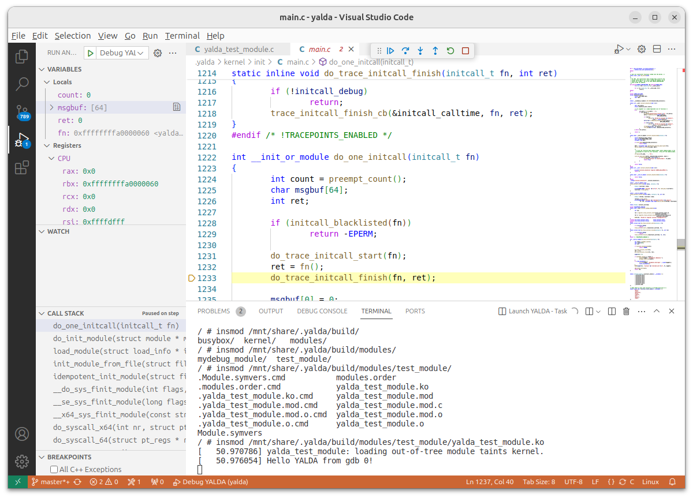

# Build and debug session within IDE
Yes. The first described tool was Microsoft VSCode
Actually, setup should be just easy. I did not want integrating YALDA's initialization steps to any IDE.
Therefore use common [(terminal approach)](README.md#start) and [IDE integration](README.md#ide-integration)

## Emacs

## VSCode
Copy `.vscode` dir from YALDA root directory to your project root and open the dir with in VSCode
You will have following tasks:
- Build - to build default target. Task is configured as default build task
- Launch YALDA - to launch OS in the internal terminal of VSCode. Task is configured as default test task
In additional it prepares your workspace for linux kernel coding and tune IntelliSense
Default debug task just makes all magic. VSCode obtains a lot of information from a debugger. So stay calm and wait

### Known issues
- There will be an issue when yalda environment is from root directory. You have to change `program` to launch to your .ko file