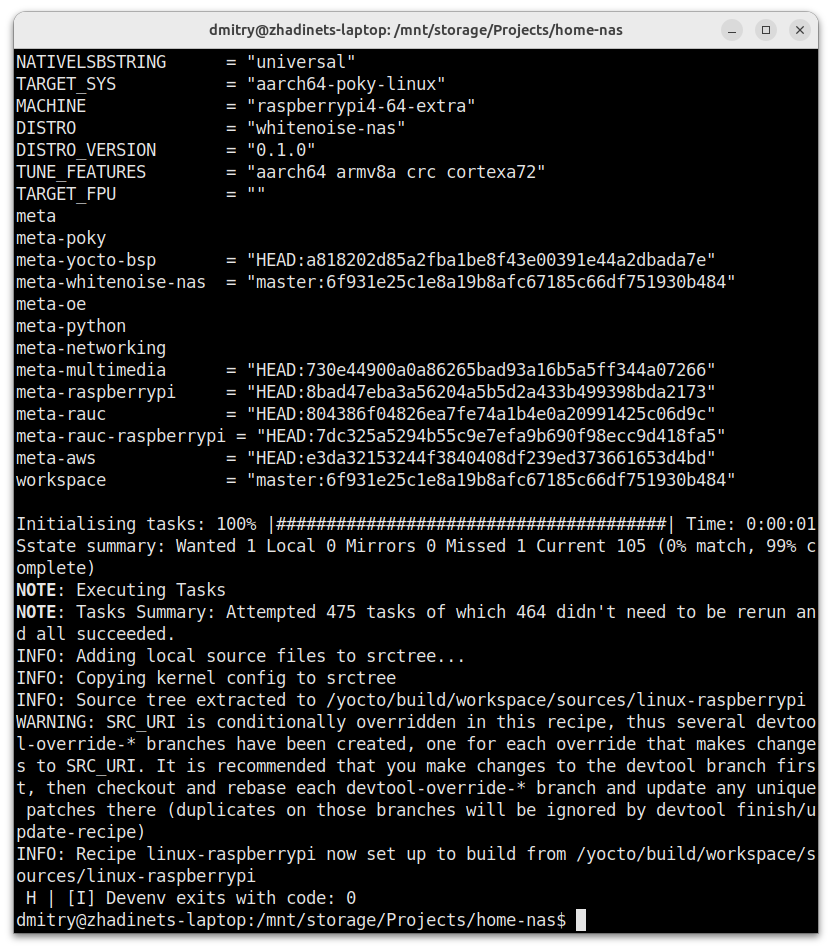
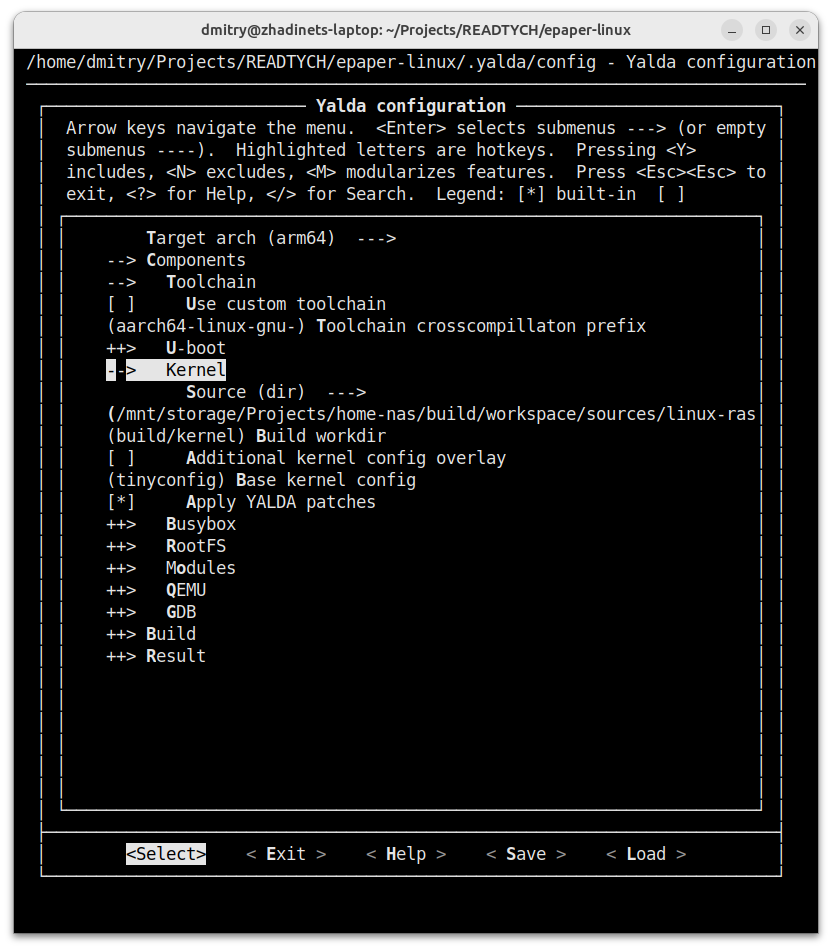

# YOCTO build and debug session

The best way to build custom YCOTO based linux is to use my DEVENV fur sure :), but YALDA is compatible with the canonical way
The difference in build steps is that the devenv gets environment and settings from the project file. General yocto's apprach is to call
the set of regular commands for project initation, synchronization, building.
Lets assume that yocto-linux is already built and it is needed to debug your kernel
First step is to separate kernel using devtool. Anyway you have to do it to maintain your changes
```bash
devenv-yocto devtool modify linux-raspberrypi
```



It will create a patched copy of kernel sources in workspace dir and write the path to it. This path need to be set in YALDA configuration
The second step is to obtain appropriate toolchain for youe hardware. In case of Raspberry in most cases you can use it from your distro
If you have specific configuration, you can ask YOCTO to build the toolchain for you
```bash
devenv-yocto meta-toolchain
```

Yocto generates kernel config in the sources dir assuming you will build there. Yalda uses separate dir for own building.
So your build becomes "not clear". If you do not need to use the same config you need to go to the dir with you kernel sources and call
```bash
cd <path to the workspace/sources/linux-raspberrypi/>
make mrproper
```
It will significantly increase building time. But If you need it then backup somewhere and set in YALDA config as a full path to it
```bash
cp <path to your yocto dir>/build/workspace/sources/linux-raspberrypi/.config <path to your module>/yocto.config
```

Then you need to install it and set correct pathes and the crosspcompillation prefix



Then you need to syncronize sources (busybox, roofts, etc) and build the kernel and other components within YALDA environment
```bash
yalda sync
yalda build
```
After this step YALDA is ready to be used to build and debug your module


